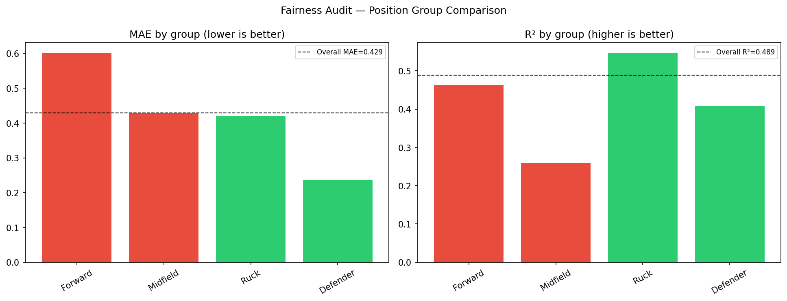
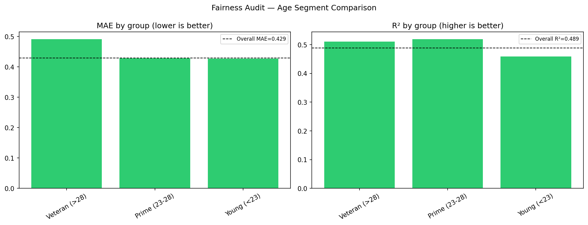
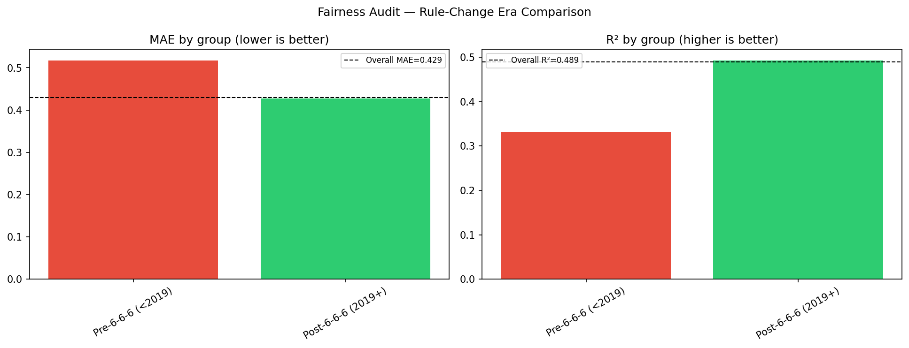
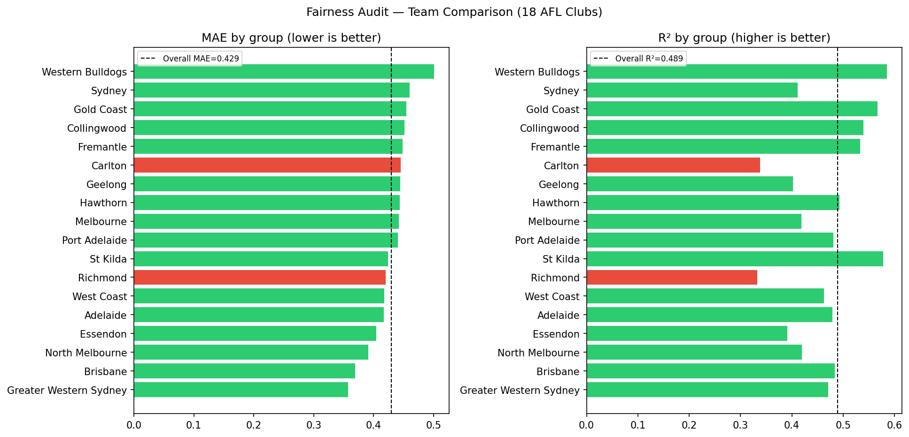

# Fairness Audit Report

**Project:** AFL Player Performance Predictor
**Author:** Tia Qiu (ML Analyst/PM)
**Date:** 2026-06-15
**Model:** XGBRegressor — `models/xgb_goal_model.pkl` (v2, trained 2020–2025)
**Framework:** `docs/fairness_audit_framework.md`

---

## Overall Model Performance (Baseline)

| Metric | Value |
|--------|-------|
| MAE | 0.4293 goals |
| RMSE | 0.6262 goals |
| R² | 0.4890 |
| Test set | 25,424 player-game observations (2018–2025) |

**Flagging thresholds:** MAE ratio > 1.3×  |  R² gap > 0.10  |  p < 0.05 (Mann-Whitney U)

---

## 1. Position Group Audit

| group | n | mae | r2 | mae_ratio | r2_gap | p_value | flagged |
| --- | --- | --- | --- | --- | --- | --- | --- |
| Forward | 8136 | 0.6011 | 0.4618 | 1.4000 | 0.0270 | 0.0000 | **YES** |
| Midfield | 8503 | 0.4291 | 0.2594 | 1.0000 | 0.2300 | 0.0000 | **YES** |
| Ruck | 1634 | 0.4196 | 0.5465 | 0.9770 | -0.0580 | 0.1760 | no |
| Defender | 7151 | 0.2363 | 0.4078 | 0.5500 | 0.0810 | 0.0000 | no |

**Findings:**
- **Forward** flagged: MAE ratio=1.40×, R² gap=0.027 — statistically significant (p=0.0000).
- **Midfield** flagged: MAE ratio=1.00×, R² gap=0.230 — statistically significant (p=0.0000).

---

## 2. Age Segment Audit

| group | n | mae | r2 | mae_ratio | r2_gap | p_value | flagged |
| --- | --- | --- | --- | --- | --- | --- | --- |
| Young (<23) | 13845 | 0.4274 | 0.4586 | 0.9960 | 0.0300 | 0.0042 | no |
| Prime (23-28) | 11055 | 0.4288 | 0.5188 | 0.9990 | -0.0300 | 0.0001 | no |
| Veteran (>28) | 524 | 0.4910 | 0.5105 | 1.1440 | -0.0210 | 0.0004 | no |

**Findings:**
- No age segments exceed thresholds. Age-based predictive parity holds.

**Context from Course 1 HTE:** Age strongly moderates physical attribute effects (young rucks show Height ATE=+8.16 vs. −2.21 for veterans). Some age-related prediction variance is expected.

---

## 3. Rule-Change Era Audit

| group | n | mae | r2 | mae_ratio | r2_gap | p_value | flagged |
| --- | --- | --- | --- | --- | --- | --- | --- |
| Pre-6-6-6 (<2019) | 568 | 0.5176 | 0.3316 | 1.2060 | 0.1570 | 0.0059 | **YES** |
| Post-6-6-6 (2019+) | 24856 | 0.4273 | 0.4928 | 0.9950 | -0.0040 | 0.0059 | no |

**Findings:**
- **Pre-6-6-6 (<2019)** flagged: MAE ratio=1.21× — statistically significant (p=0.0059).

---

## 4. Team Group Audit

| | |
|--|--|
| Teams audited | 18 |
| Best-predicted | Greater Western Sydney (MAE=0.3576) |
| Worst-predicted | Western Bulldogs (MAE=0.5012, ratio=1.17×) |
| Teams flagged | 2 |
| Flagged teams | Carlton, Richmond |

Full team results in `reports/fairness_metrics.csv`.

**Findings:**
- 2 team(s) flagged. Recommend checking whether flagged teams have unusual player profiles under-represented in training data.

---

## Summary

| Audit Group | Groups Tested | Flagged | Result |
|-------------|--------------|---------|--------|
| Position | 4 | 2 | NEEDS REVIEW |
| Age Segment | 3 | 0 | PASS |
| Rule-Change Era | 2 | 1 | NEEDS REVIEW |
| Team | 18 | 2 | NEEDS REVIEW |

**Total flagged groups: 5**

---

## Recommended Actions

Based on flagged groups:

1. **Re-weight training samples** for flagged position/age groups
2. **Add age×position interaction features** if young-player error persists
3. **Add era indicator features** (`Post666`, `RotEra`) to explicitly model rule-change effects
4. **Re-run audit** after any mitigation to verify improvement

---

## Methodology

- **Test set:** Chronological 20% holdout (last 20% of rows by time)
- **Statistical test:** Mann-Whitney U (two-sided), each group vs. rest
- **Significance threshold:** p < 0.05
- **Minimum group size:** 20 observations
- **SHAP individual fairness:** Pending — use `POST /predict/explain` for per-player checks

*Generated by `src/visualization/fairness_audit.py`*
