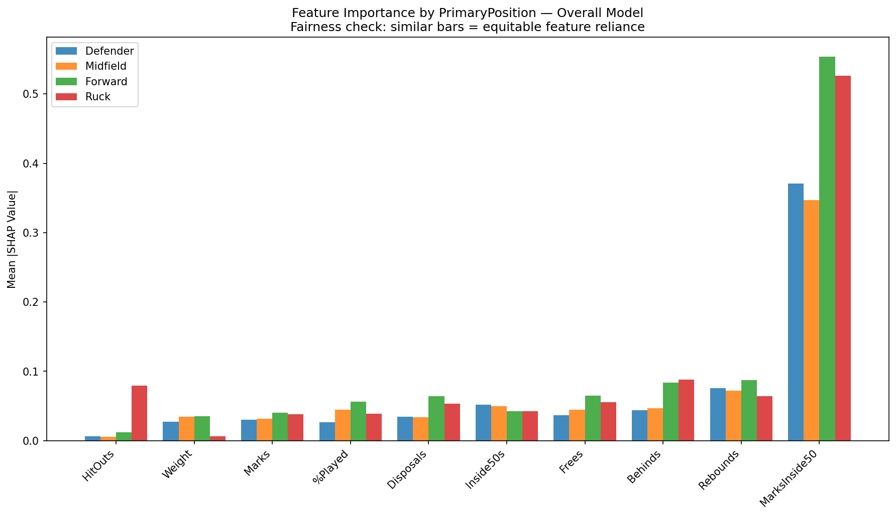
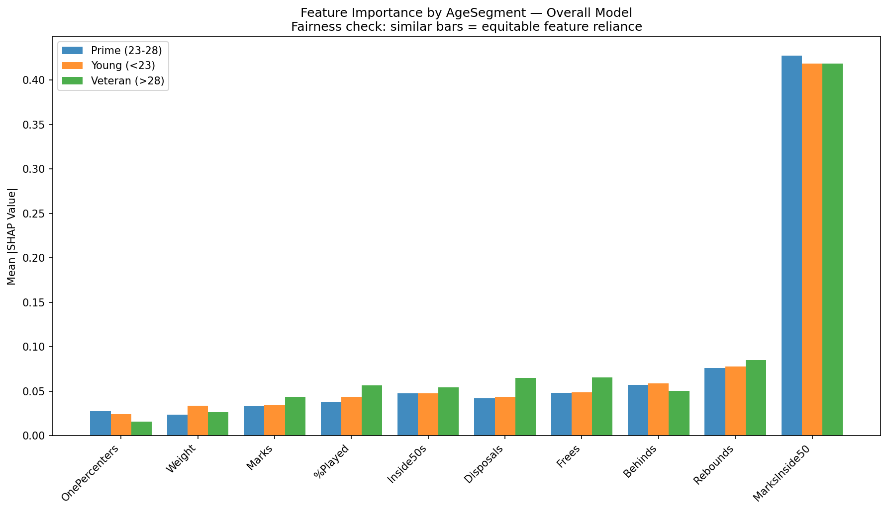

# Fairness Audit Report

**Project:** AFL Player Performance Predictor
**Author:** Tia Qiu (ML Analyst/PM)
**Date:** 2026-06-15
**Model:** XGBRegressor — `models/xgb_goal_model.pkl` (v2, trained 2020–2025)
**Framework:** `docs/fairness_audit_framework.md`

---

## Overall Model Performance (Baseline)

| Metric | Value |
|--------|-------|
| MAE | 0.4174 goals |
| RMSE | 0.6020 goals |
| R² | 0.4883 |
| Test set | 10,965 player-game observations (2021–2025) |

**Flagging thresholds:** MAE ratio > 1.3×  |  R² gap > 0.10  |  p < 0.05 (Mann-Whitney U)

---

## 1. Position Group Audit

| group | n | mae | r2 | mae_ratio | r2_gap | p_value | flagged |
| --- | --- | --- | --- | --- | --- | --- | --- |
| Forward | 3003 | 0.5800 | 0.4513 | 1.3900 | 0.0370 | 0.0000 | **YES** |
| Midfield | 4025 | 0.4196 | 0.3287 | 1.0050 | 0.1600 | 0.0000 | **YES** |
| Ruck | 619 | 0.3989 | 0.6530 | 0.9560 | -0.1650 | 0.1961 | **YES** |
| Defender | 3318 | 0.2710 | 0.3987 | 0.6490 | 0.0900 | 0.0000 | no |

**Individual fairness — does the model rely on the same features for every position?**

HitOuts stands out distinctly for Ruck and barely registers for other positions — expected, since it's the position-defining stat, not a fairness concern. All other features show broadly consistent reliance across positions, including MarksInside50 (the dominant feature for every position, not just Forward).

**Findings:**
- **Forward** flagged: MAE ratio=1.39×, R² gap=0.037 — statistically significant (p=0.0000).
- **Midfield** flagged: MAE ratio=1.00×, R² gap=0.160 — statistically significant (p=0.0000).
- **Ruck** flagged: MAE ratio=0.96×, R² gap=-0.165 — not statistically significant.

---

## 2. Age Segment Audit

| group | n | mae | r2 | mae_ratio | r2_gap | p_value | flagged |
| --- | --- | --- | --- | --- | --- | --- | --- |
| Young (<23) | 8175 | 0.4263 | 0.4816 | 1.0210 | 0.0070 | 0.0000 | no |
| Prime (23-28) | 2783 | 0.3913 | 0.5095 | 0.9370 | -0.0210 | 0.0000 | no |

**Individual fairness — does the model rely on the same features for every age segment?**

All three age segments — including Veteran, which has too few rows for the formal statistical test above — show remarkably similar reliance on every feature. Strong confirmation that age-based individual fairness holds, consistent with the predictive parity result.

**Findings:**
- No age segments exceed thresholds. Age-based predictive parity holds.

**Context from Course 1 HTE:** Age strongly moderates physical attribute effects (young rucks show Height ATE=+8.16 vs. −2.21 for veterans). Some age-related prediction variance is expected.

---

## 3. Rule-Change Era Audit

**Not applicable.** The model is trained and tested only on 2020+ data (see `docs/model_card.md`), so every row in the test set is already Post-6-6-6 — there are no pre-2019 rows left to compare against. This audit dimension cannot be evaluated for this model version.

---

## 4. Team Group Audit

| | |
|--|--|
| Teams audited | 18 |
| Best-predicted | West Coast (MAE=0.3236) |
| Worst-predicted | Collingwood (MAE=0.4933, ratio=1.18×) |
| Teams flagged | 5 |
| Flagged teams | Carlton, Fremantle, Port Adelaide, West Coast, Western Bulldogs |

Full team results in `reports/fairness_metrics.csv`.

**Findings:**
- 5 team(s) flagged. Recommend checking whether flagged teams have unusual player profiles under-represented in training data.

---

## Summary

| Audit Group | Groups Tested | Flagged | Result |
|-------------|--------------|---------|--------|
| Position | 4 | 3 | NEEDS REVIEW |
| Age Segment | 2 | 0 | PASS |
| Rule-Change Era | 0 | 0 | N/A — no pre-2019 data in test set |
| Team | 18 | 5 | NEEDS REVIEW |

**Total flagged groups: 8**

---

## Recommended Actions

Based on flagged groups:

1. **Re-weight training samples** for flagged position/age groups
2. **Add age×position interaction features** if young-player error persists
3. **Add era indicator features** (`Post666`, `RotEra`) to explicitly model rule-change effects
4. **Re-run audit** after any mitigation to verify improvement

---

## Methodology

- **Test set:** Chronological 20% holdout (last 20% of rows by time)
- **Statistical test:** Mann-Whitney U (two-sided), each group vs. rest
- **Significance threshold:** p < 0.05
- **Minimum group size:** 20 observations
- **SHAP individual fairness:** Mean |SHAP| feature-reliance compared across Position and Age Segment groups (see plots above). Team-level SHAP comparison skipped — 18 groups would be unreadable in one chart; use `POST /predict/explain` for team- or player-specific checks.

*Generated by `src/visualization/fairness_audit.py`*
